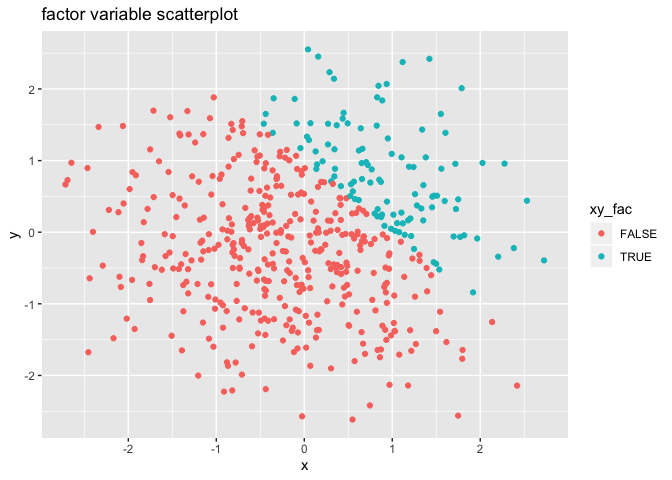

p8105\_hw1\_wz2507
================
Wurongyan Zhang
9/15/2019

## problem 1

``` r
#create dataframe
set.seed(500)
df = tibble(
  nsamp = rnorm(8),
  nsamp_pos = nsamp > 0,
  vec_char = c("a","b","c","d","e","f","g","h"),
  vec_fac = factor(c("1","1","1","2","2","2","3","3"))
)

#take the mean of each varaible
mean_nsamp = mean(pull(df, nsamp))
#mean_nsamp
mean_nsamp_pos = mean(pull(df, nsamp_pos))
#mean_nsamp_pos
mean_vec_char = mean(pull(df, vec_char))

#mean_vec_char
mean_vec_fac = mean(pull(df, vec_fac))
#mean_vec_fac
```

Comment: Numerical variables and logical variables can take the mean but
character and factor variables could not take the mean. However, logical
variable can take the mean because the levels are considered as “1 or
0”’s for “True” and “False”.

``` r
#try to use as.numeric to convert variables
num_logic = as.numeric(pull(df,nsamp_pos))
num_char = as.numeric(pull(df,vec_char))
num_fac = as.numeric(pull(df,vec_fac))
mean(num_logic)
mean(num_char) #this results in "NA"
mean(num_fac)
```

Comment: Logical vector changed from “True” or “False” to “1” and “0”.
Character vector changed from character to “NA”’s. Factor vector changed
to numbers. The mean of the logical variable did not change, character
variables still could not take the mean, and the mean of factor variable
can be taken. Factor and logical variable can be divided into different
levels and can be presented as numbers after the command as.numeric, so
both of them can take the mean after transformed them into
numerics(factor variables converted to “1”, “2” and “3”’s in this case).
However, character variables cannot be presented as numbers so it could
not take the mean.

``` r
#multiplication after conversion
(pull(df, nsamp))*as.numeric(pull(df,nsamp_pos))
(pull(df, nsamp))*as.factor(pull(df,nsamp_pos)) #this command still present NA's
(as.numeric(as.factor(pull(df,nsamp_pos))))*(pull(df, nsamp))
```

Comment: Factor variables could not multiply like numeric variables so
if we factorize logical variable, the multiplication would not work
since it turned into “True” and “False” instead of “1” and “0”. However,
if we use the numeric levels of logical variable, the multiplication
would work since it transformed to strings.

## Problem 2

``` r
#create the data frame
set.seed(500)
df2 = tibble(
  x = rnorm(500),
  y = rnorm(500),
  xy_1 = x + y > 1,
  xy_num = as.numeric(xy_1),
  xy_fac = as.factor(xy_1) 
)
```

The size of the data set is 500 and 5. The mean of the data set is
-0.0455615, median is -0.0385267, standard deviation is 1.0165813 . The
proportion of the cases for which x+y\>1 is 0.22.

``` r
#create the scatterplot by using gg plot
library(ggplot2)

ggplot(data=df2, aes(x = x, y = y, color = xy_1)) + geom_point() + labs(title = "logical variable scatterplot")
```

<!-- -->

``` r
#save the plot
ggsave("logical variable scatterplot.pdf")
```

    ## Saving 7 x 5 in image

``` r
ggplot(data=df2, aes(x = x, y = y, color = xy_num)) + geom_point()+ labs(title = "numeric variable scatterplot")
```

<!-- -->

``` r
ggplot(data=df2, aes(x = x, y = y, color = xy_fac)) + geom_point()+ labs(title = "factor variable scatterplot")
```

<!-- -->

Comment: All plots’ colors were divided by the line x+y=1 with x+y\>1
are above the line in green/blue and x+y\<1 are below the line in red.
The color scale of logical vector is just “True” and “False”. For the
color scale after numeric the logical vector, it turned into a continuum
of color scale with a range of number from 0 to 1. However, the color
scale of factoring the variable is same as logical vector’s but for
color only depends on true or false while logical vector depends on
whether x+y\>1 or not.
